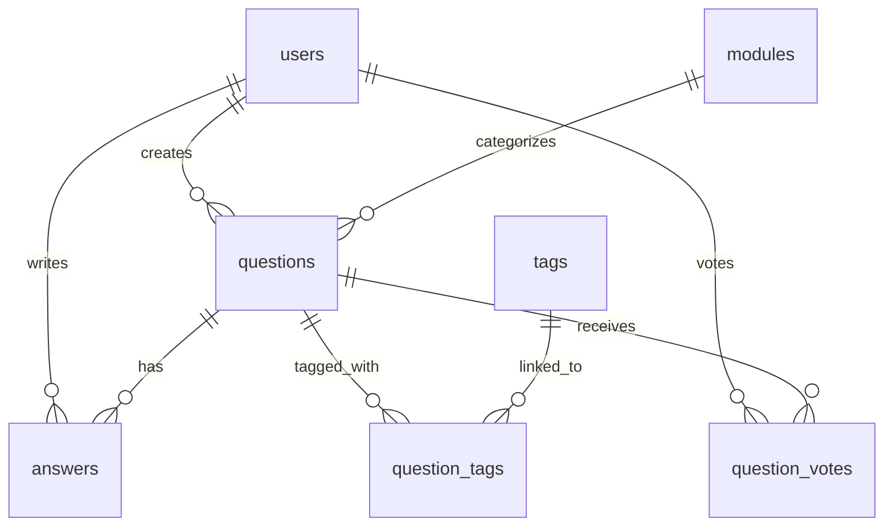

# Q&A Platform for Students

> A modern Q&A platform for university students to ask and answer questions related to their courses.

## 🌟 Features

### User Features
- **Authentication System**
  - Secure registration and login
  - Password hashing with PHP `password_hash()`
  - Session-based authentication
  - Forgot password functionality

- **Question Management**
  - Post questions with text content
  - Upload images for questions (JPG, PNG, GIF)
  - Categorize questions by modules (courses)
  - Tag questions with multiple tags
  - Questions require admin approval before public display
  - Edit and delete own questions

- **Answer System**
  - Answer questions with text content
  - Edit and delete own answers
  - View all answers for a question

- **Voting System**
  - Upvote/downvote questions (AJAX-based)
  - Real-time vote count updates
  - One vote per user per question

- **Search & Filter**
  - Global search across questions, tags, and modules
  - Filter questions by module
  - Filter questions by tags (AND logic - must have all selected tags)
  - Search results with type filtering

- **Community Features**
  - View trending topics (most used tags)
  - Top contributors leaderboard
  - Filter leaderboard by module and time range
  - View similar questions in the same module

- **User Profile**
  - View user profile
  - Profile management

### Admin Features
- **Dashboard**
  - System statistics (users, questions, answers, modules)
  - Pending questions alert
  - Unread contact messages alert

- **Content Management**
  - Approve/reject questions
  - Manage all questions (view, edit, delete)
  - Manage all answers (view, edit, delete)
  - Manage modules (CRUD)
  - Manage tags (CRUD)

- **User Management**
  - View all users
  - Edit user information
  - Change user roles
  - Delete users

- **Contact Management**
  - View contact form submissions
  - Mark messages as read/unread
  - Email notifications (via PHPMailer)

## 🚀 Technologies

- **Frontend**: HTML5, CSS3, JavaScript (ES6+)
- **Backend**: PHP 8.0+
- **Database**: MySQL/MariaDB
- **Server**: Apache (XAMPP/WAMP/MAMP)
- **Additional Libraries**: PHPMailer for email functionality

## 📂 Project Structure

```
courseworkWeb1V2/
├── admin/                 # Admin panel pages
│   ├── dashboard.php      # Admin dashboard with statistics
│   ├── manage_questions.php
│   ├── manage_answers.php
│   ├── manage_users.php
│   ├── manage_modules.php
│   ├── manage_tags.php
│   ├── manage_contacts.php
│   └── settings.php
├── answers/               # Answer CRUD operations
│   ├── add.php
│   ├── edit.php
│   └── delete.php
├── assets/
│   ├── css/
│   │   └── style.css      # Main stylesheet
│   ├── js/
│   │   ├── vote.js        # AJAX voting functionality
│   │   ├── questions-tag-filter.js
│   │   ├── tags-filter.js
│   │   └── script.js
│   ├── phpmailer/         # PHPMailer library
│   └── uploads/
│       └── posts/          # Uploaded question images
├── auth/                  # Authentication
│   ├── login.php
│   ├── register.php
│   ├── logout.php
│   └── forgot_password.php
├── config/
│   ├── constants.php      # BASE_URL, APP_NAME, SMTP config
│   └── db.php             # PDO database connection
├── contact/
│   ├── contact.php        # Contact form page
│   └── email_to_users.php
├── contributors/
│   └── leaderboard.php    # Top contributors ranking
├── includes/              # Reusable components
│   ├── header.php
│   ├── footer.php
│   ├── navbar.php
│   ├── functions.php      # Helper functions
│   └── comingSoon.php
├── modules/               # Module management
│   ├── list.php
│   ├── add.php
│   ├── edit.php
│   └── delete.php
├── questions/             # Question management
│   ├── list.php           # Questions listing with filters
│   ├── view.php           # Question detail page
│   ├── add.php
│   ├── edit.php
│   ├── delete.php
│   └── approve.php        # Admin approval
├── search/
│   └── search.php         # Global search page
├── tags/                  # Tag management
│   ├── list.php
│   ├── add.php
│   └── delete.php
├── users/                 # User management
│   ├── list.php
│   ├── profile.php
│   ├── edit.php
│   └── delete.php
├── votes/
│   └── vote.php           # AJAX vote endpoint
├── database.sql           # Database schema and seed data
├── index.php              # Homepage
└── README.md
```

## 🛠️ Installation & Setup

### Requirements

- PHP 8.0 or higher (recommended 8.1+)
- MySQL 5.7+ or MariaDB 10.3+
- Apache web server (XAMPP/WAMP/MAMP)
- Modern web browser (Chrome, Firefox, Edge)

### Step-by-Step Installation

1. **Download/Clone the project**
   ```bash
   # Clone the repository
   git clone [repository-url]
   
   # Or download and extract ZIP to your web server directory
   # For XAMPP: C:\xampp\htdocs\COMP1841\courseworkWeb1V2
   ```

2. **Create Database**
   - Open phpMyAdmin
   - Create a new database named `courseworkweb1v2` (or update `config/db.php` to match your database name)
   - Import the `database.sql` file
   - The script will create all tables, indexes, and seed initial data (admin account + 3 sample modules)

3. **Configure Database Connection**
   - Open `config/db.php`
   - Update the following variables if needed:
     ```php
     $DB_HOST = '127.0.0.1';      // Database host
     $DB_NAME = 'courseworkweb1v2'; // Database name
     $DB_USER = 'root';            // Database username
     $DB_PASS = '';                // Database password
     ```

4. **Configure Application Constants**
   - Open `config/constants.php`
   - Update `BASE_URL` to match your installation path:
     ```php
     define('BASE_URL', '/COMP1841/courseworkWeb1V2/');
     // Or for root: define('BASE_URL', '/');
     ```
   - Update `ADMIN_EMAIL` if needed
   - Configure SMTP settings (optional, for email functionality):
     ```php
     define('SMTP_HOST', 'smtp.example.com');
     define('SMTP_PORT', 587);
     define('SMTP_USER', 'your_smtp_user');
     define('SMTP_PASS', 'your_smtp_password');
     define('SMTP_SECURE', 'tls');
     ```

5. **Set File Permissions** (Linux/macOS)
   ```bash
   chmod -R 755 courseworkWeb1V2
   chmod -R 775 courseworkWeb1V2/assets/uploads/posts
   ```

6. **Start the Application**
   - Start Apache and MySQL in XAMPP/WAMP/MAMP
   - Open browser and navigate to: `http://localhost/COMP1841/courseworkWeb1V2/`

### Default Login Credentials

- **Admin Account:**
  - Email: `thuong.admin@gmail.com`
  - Password: `123`
  - ⚠️ **Important:** Change the password after first login!

- **Regular Users:**
  - No default users provided
  - Use the registration page to create new accounts

## 👥 User Roles & Permissions

| Role | Permissions |
|------|-------------|
| **User** | • Register/Login<br>• Post questions (pending approval)<br>• Edit/delete own questions<br>• Add/edit/delete own answers<br>• View approved questions<br>• Vote on questions<br>• Search and filter<br>• View leaderboard<br>• Contact form |
| **Admin** | • All user permissions<br>• Access admin dashboard<br>• Approve/reject questions<br>• Edit/delete any content<br>• Manage users (edit roles, delete)<br>• Manage modules<br>• Manage tags<br>• View and manage contact messages |

## 🗄️ Database Schema

The database consists of 8 main tables:

### Tables Overview

1. **`users`** - User accounts and authentication
   - Fields: `id`, `username`, `email`, `password`, `role`, `created_at`
   - Unique constraints on `username` and `email`

2. **`modules`** - Course modules (e.g., COMP1841, MATH100)
   - Fields: `module_id`, `module_code`, `module_name`, `created_at`
   - Unique constraint on `module_code`

3. **`questions`** - User-submitted questions
   - Fields: `id`, `title`, `content`, `image`, `user_id`, `module_id`, `status`, `created_at`, `updated_at`
   - Status: `pending`, `approved`, `rejected`
   - Foreign keys: `user_id` → `users.id` (CASCADE), `module_id` → `modules.module_id` (RESTRICT)

4. **`tags`** - Question tags for categorization
   - Fields: `id`, `name`
   - Unique constraint on `name`

5. **`question_tags`** - Many-to-many relationship between questions and tags
   - Composite primary key: `(question_id, tag_id)`
   - Foreign keys with CASCADE delete

6. **`answers`** - Answers to questions
   - Fields: `id`, `question_id`, `user_id`, `content`, `created_at`, `updated_at`
   - Foreign keys with CASCADE delete

7. **`question_votes`** - User votes on questions
   - Composite primary key: `(user_id, question_id)`
   - Fields: `value` (1 for upvote, -1 for downvote), `created_at`
   - Foreign keys with CASCADE delete

8. **`contacts`** - Contact form submissions
   - Fields: `id`, `name`, `email`, `message`, `is_read`, `created_at`
   - `is_read` flag for admin tracking

### Entity Relationship Diagram



### Key Relationships

- **Users → Questions**: One-to-many (CASCADE delete)
- **Users → Answers**: One-to-many (CASCADE delete)
- **Users → Votes**: One-to-many (CASCADE delete)
- **Modules → Questions**: One-to-many (RESTRICT delete - must handle questions before deleting module)
- **Questions → Answers**: One-to-many (CASCADE delete)
- **Questions ↔ Tags**: Many-to-many via `question_tags` (CASCADE delete)

## 🔒 Security Features

- **Password Security**
  - Passwords hashed using PHP `password_hash()` with bcrypt
  - Password verification with `password_verify()`

- **SQL Injection Prevention**
  - All database queries use PDO prepared statements
  - Parameter binding for user inputs

- **XSS Prevention**
  - Input sanitization with `htmlspecialchars()`
  - Output escaping with `e()` helper function

- **Access Control**
  - Session-based authentication
  - Role-based authorization (`ensure_login()`, `ensure_admin()`)
  - Protected routes for admin-only pages

- **File Upload Security**
  - File type validation (JPG, PNG, GIF only)
  - File size limits (5MB default)
  - Unique filename generation (timestamp + random)

## 📋 Business Workflow

1. **User Registration & Login**
   - New users register with email, username, and password
   - Password is hashed before storage
   - Users are assigned `user` role by default
   - Login creates session with `user_id`, `username`, and `role`

2. **Posting Questions**
   - User fills form with title, content, optional image
   - Selects module and tags
   - Question saved with `status = 'pending'`
   - Question not visible publicly until admin approval

3. **Question Approval**
   - Admin reviews pending questions in dashboard
   - Can approve (`status = 'approved'`) or reject (`status = 'rejected'`)
   - Approved questions appear in public listings and search

4. **Community Interaction**
   - Users can vote on approved questions (upvote/downvote)
   - Users can add answers to questions
   - Users can edit/delete their own content
   - Votes contribute to user's points in leaderboard

5. **Search & Discovery**
   - Users can search across questions, tags, and modules
   - Filter questions by module and/or tags
   - View trending topics and top contributors

## ⚙️ Configuration Notes

### Image Uploads
- Upload directory: `assets/uploads/posts/`
- Directory is auto-created if it doesn't exist
- File naming: `{timestamp}_{random}.{ext}`
- Supported formats: JPG, JPEG, PNG, GIF
- Max file size: 5MB (configurable in `includes/functions.php`)

### BASE_URL Configuration
- Must end with `/`
- Examples:
  - Subdirectory: `/COMP1841/courseworkWeb1V2/`
  - Root: `/`
  - Full URL: `http://localhost/COMP1841/courseworkWeb1V2/`

### Email Configuration (Optional)
- PHPMailer library included in `assets/phpmailer/`
- Configure SMTP settings in `config/constants.php`
- If SMTP not configured, contact form still saves to database
- Email service used for contact form notifications

## 🎓 Learning Outcomes

This project demonstrates:
- ✅ Full-stack web development (PHP, MySQL, HTML, CSS, JavaScript)
- ✅ MVC-inspired architecture
- ✅ CRUD operations
- ✅ User authentication & authorization
- ✅ Role-based access control (RBAC)
- ✅ Database design & relationships
- ✅ AJAX for dynamic interactions
- ✅ File upload handling
- ✅ Search and filtering functionality
- ✅ Responsive web design
- ✅ Security best practices
- ✅ Code organization & maintainability

## 🚧 Future Enhancements

Potential improvements for future versions:
- Rich text editor for questions/answers
- Answer voting system
- Comment system for questions/answers
- User notifications
- Email verification
- Pagination for large lists
- Advanced search with full-text indexing
- User reputation system
- Question following/bookmarking
- Edit history tracking

## 📝 License

This project is created for educational purposes as part of COMP1841 - Web Development coursework at Greenwich University Vietnam.

## 👨‍💻 Author

**Thuong Le Van**  
COMP1841 - Web Development  
Greenwich University Vietnam

## 🙏 Acknowledgments

- Greenwich University Vietnam for the coursework opportunity
- Stack Overflow community for inspiration
- Modern web design trends and best practices
- PHPMailer library contributors

---

**Last Updated:** January 2025  
**Version:** 2.0  
**Status:** Production Ready ✅
