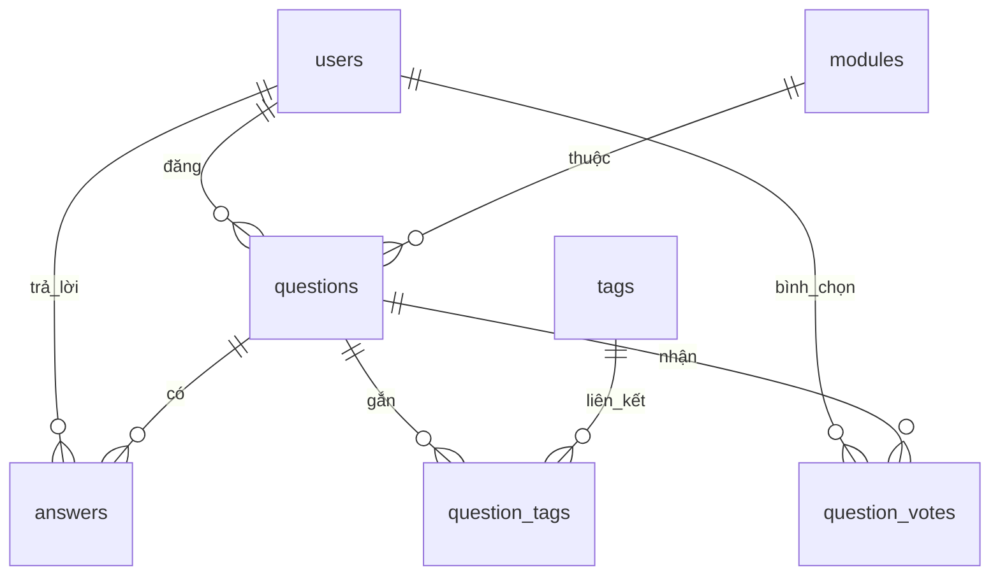

# CourseworkWeb1V2 – Nền tảng Hỏi & Đáp cho sinh viên

> Dự án môn COMP1841 – Web Development (XAMPP + PHP + MySQL)

---

## 📑 Mục lục

1. [Tổng quan](#tổng-quan)
2. [Chức năng chính](#chức-năng-chính)
3. [Kiến trúc & Công nghệ](#kiến-trúc--công-nghệ)
4. [Cấu trúc thư mục](#cấu-trúc-thư-mục)
5. [Cài đặt & cấu hình](#cài-đặt--cấu-hình)
6. [Tài khoản & phân quyền](#tài-khoản--phân-quyền)
7. [Lược đồ cơ sở dữ liệu](#lược-đồ-cơ-sở-dữ-liệu)
8. [Quy trình nghiệp vụ](#quy-trình-nghiệp-vụ)
9. [Ghi chú cấu hình nâng cao](#ghi-chú-cấu-hình-nâng-cao)
10. [Định hướng mở rộng](#định-hướng-mở-rộng)

---

## Tổng quan

CourseworkWeb1V2 là ứng dụng web hỏi đáp (Q&A) lấy cảm hứng từ Stack Overflow, dùng cho cộng đồng sinh viên CNTT. Sinh viên có thể đặt câu hỏi theo từng học phần (module), gắn thẻ (tag), bình chọn, trả lời và tương tác. Ban quản trị (admin) chịu trách nhiệm phê duyệt nội dung, quản lý danh mục, người dùng và phản hồi liên hệ.

**Đặc điểm nổi bật:**

- Giao diện dark mode hiện đại, tương thích desktop/mobile.
- Quản lý đầy đủ vòng đời câu hỏi: tạo → chờ duyệt → hiển thị công khai.
- Hệ thống bình chọn & bảng xếp hạng dựa trên điểm vote.
- Tìm kiếm đa chiều (câu hỏi, thẻ, module) kèm lọc theo tag logic AND.
- Quản trị tập trung: câu hỏi, trả lời, người dùng, module, tag, liên hệ.

---

## Chức năng chính

### 1. Xác thực & phân quyền người dùng

- Đăng ký tài khoản mới với kiểm tra trùng email/username, mật khẩu mã hóa bằng `password_hash` (bcrypt).
- Đăng nhập, lưu phiên thông qua `$_SESSION`, chuyển hướng theo vai trò (admin → dashboard, user → trang chủ).
- Bảo vệ trang quan trọng bằng `ensure_login()` và `ensure_admin()` (@includes/functions.php#21-38).
- Đăng xuất bằng cách hủy session.

### 2. Quản lý câu hỏi (@questions)

- **Tạo câu hỏi:** yêu cầu đăng nhập, nhập tiêu đề, nội dung, chọn module, gắn nhiều tag, tùy chọn tải ảnh (giới hạn ~5MB, đuôi jpg/png/gif). Câu hỏi mới lưu ở trạng thái `pending` để admin duyệt (@questions/add.php#6-36).
- **Danh sách câu hỏi:** trang `/questions/list.php` hiển thị tối đa 50 câu hỏi đã duyệt, sắp xếp theo điểm vote rồi thời gian, cho phép lọc theo module và theo nhiều tag kết hợp (AND).
- **Xem chi tiết:** trang `/questions/view.php` hiển thị nội dung đầy đủ, ảnh, tag, điểm vote, các câu hỏi tương tự cùng module và quyền chỉnh sửa/xóa cho tác giả hoặc admin.
- **Chỉnh sửa/Xóa:** tác giả hoặc admin có thể cập nhật tiêu đề, nội dung, module, tag, ảnh; xóa câu hỏi sẽ xóa kèm trả lời, tag liên kết, lượt vote (ràng buộc ON DELETE CASCADE).

### 3. Quản lý trả lời (@answers)

- Người dùng đăng nhập có thể thêm trả lời tại `/answers/add.php`, nội dung lưu kèm user_id và thời gian.
- Tác giả trả lời hoặc admin có thể chỉnh sửa, xóa (@answers/edit.php, @answers/delete.php).
- Trên trang câu hỏi hiển thị danh sách trả lời theo thứ tự thời gian.

### 4. Bình chọn câu hỏi (@votes)

- Người dùng đăng nhập bấm 👍/👎 để tăng/giảm điểm câu hỏi qua API `/votes/vote.php`, xử lý bằng AJAX fetch trong `assets/js/vote.js` (@assets/js/vote.js#1-64).
- Điểm số cập nhật tức thời, lưu trạng thái cục bộ bằng `localStorage` để duy trì hiển thị sau khi tải lại trang.
- Dữ liệu lưu trong bảng `question_votes` với khóa chính (user_id, question_id) đảm bảo mỗi người chỉ có một phiếu.

### 5. Module & Tag

- Trang `/modules/list.php` liệt kê học phần, chỉ admin mới thấy nút thêm/sửa/xóa. Module dùng để phân loại câu hỏi và lọc dữ liệu.
- Trang `/tags/list.php` hiển thị toàn bộ tag, số lượng câu hỏi gắn thẻ, cho phép chọn nhiều tag để lọc (logic AND). Admin có thể thêm tag mới (nếu trùng sẽ bỏ qua) và xóa tag không dùng nữa.

### 6. Tìm kiếm (@search/search.php)

- Form tìm kiếm trên navbar gửi tới `/search/search.php`.
- Cho phép tìm theo 3 thực thể: câu hỏi (tiêu đề/nội dung/tag), tag, module; có bộ lọc `type=all|questions|tags|modules`.
- Hiển thị tổng số kết quả, gom nhóm theo từng loại, kèm dữ liệu phụ (ví dụ số câu hỏi của tag, số câu hỏi của module).

### 7. Trang liên hệ (@contact/contact.php)

- Form hai cột với các trường Name, Email, Address, Phone, Message.
- Kiểm tra ràng buộc server-side, lưu vào bảng `contacts` và đánh dấu `is_read = 0` mặc định.
- Nếu dự án cài PHPMailer (thông qua thư mục `vendor/`), hệ thống thử gửi email tới `ADMIN_EMAIL`, nếu thất bại sẽ fallback về `mail()` mặc định.

### 8. Khu vực quản trị (@admin)

- **Dashboard:** tổng hợp số lượng user, module, câu hỏi, trả lời; cảnh báo nếu có câu hỏi pending hoặc liên hệ chưa đọc (@admin/dashboard.php#5-74).
- **Quản lý câu hỏi/ trả lời/ người dùng/ module/ tag:** các trang `manage_*.php` hỗ trợ tìm kiếm, duyệt, sửa, xóa, đổi quyền.
- **Quản lý liên hệ:** đánh dấu tin nhắn đã đọc, trả lời thủ công qua email.

### 9. Trang chủ (@index.php)

- Khu vực hero giới thiệu, CTA tới mục câu hỏi.
- Lưới câu hỏi mới nhất (12 câu hỏi đã duyệt) kèm module, tác giả, số trả lời, tag, điểm vote.
- Sidebar chủ đề nổi bật (truy vấn top 8 tag) và top contributor theo điểm vote.

---

## Kiến trúc & Công nghệ

- **Backend:** PHP 8 (tương thích 7.4+), mô hình procedural kết hợp helper, PDO với prepared statement, session PHP nguyên bản.
- **Database:** MySQL/MariaDB; sử dụng ngoại khóa, chỉ số tối ưu cho truy vấn lọc theo module/tag.
- **Frontend:** HTML5 + CSS3 thuần (Flex/Grid), JavaScript ES6 (fetch API, DOM event delegation). Không dùng framework CSS/JS bên thứ ba.
- **Môi trường phát triển:** XAMPP (Apache + MySQL), Visual Studio Code khuyên dùng.

---

## Cấu trúc thư mục

```
courseworkWeb1V2/
├── admin/                 # Trang quản trị (dashboard, manage_*.php)
├── answers/               # CRUD trả lời
├── assets/
│   ├── css/style.css      # Giao diện chính
│   ├── js/vote.js         # Logic bình chọn AJAX
│   └── uploads/posts/     # Thư mục ảnh câu hỏi (tạo tự động)
├── auth/                  # Đăng nhập, đăng ký, đăng xuất
├── config/
│   ├── constants.php      # BASE_URL, APP_NAME, SMTP cấu hình
│   └── db.php             # Kết nối PDO tới MySQL
├── contact/contact.php    # Trang liên hệ
├── contributors/          # Bảng xếp hạng (leaderboard.php)
├── includes/              # Header, footer, navbar, helpers
├── modules/               # Trang danh sách/CRUD module
├── questions/             # Trang danh sách, thêm, sửa, xem chi tiết
├── search/                # Trang tìm kiếm toàn cục
├── tags/                  # Trang danh sách/CRUD tag + lọc câu hỏi
├── users/                 # Trang quản lý user dành cho admin
├── votes/                 # API xử lý bình chọn
├── database.sql           # Script tạo & seed cơ sở dữ liệu
└── index.php              # Trang chủ
```

---

## Cài đặt & cấu hình

### Yêu cầu hệ thống

- PHP 8.0 trở lên (khuyến nghị 8.1)
- MySQL 5.7+ hoặc MariaDB 10+
- Apache (XAMPP/WAMP/MAMP) hoặc máy chủ tương đương
- Trình duyệt hiện đại (Chrome, Firefox, Edge…)

### Các bước triển khai tại localhost

1. **Tải mã nguồn**
   - Clone bằng Git hoặc tải ZIP và giải nén vào `C:\xampp\htdocs\COMP1841\courseworkWeb1V2`.

2. **Khởi tạo cơ sở dữ liệu**
   - Mở phpMyAdmin → tạo database tên `courseworkweb1v2` (trùng với `config/db.php`).
   - Import tệp `database.sql`. Script sẽ tạo toàn bộ bảng, chỉ mục, dữ liệu mẫu (bao gồm 1 tài khoản admin).

3. **Cấu hình kết nối**
   - Mở `config/db.php`, chỉnh `DB_HOST`, `DB_NAME`, `DB_USER`, `DB_PASS` cho phù hợp môi trường.
   - Mặc định: host `127.0.0.1`, user `root`, mật khẩu rỗng.

4. **Cấu hình hằng số ứng dụng**
   - Trong `config/constants.php`, đảm bảo `BASE_URL` khớp với đường dẫn thực tế (ví dụ `/COMP1841/courseworkWeb1V2/` hoặc `http://localhost/...`).
   - Chỉnh `APP_NAME`, email admin, thông tin SMTP nếu cần gửi mail.

5. **Phân quyền thư mục upload (nếu Linux/macOS)**
   ```bash
   chmod -R 755 courseworkWeb1V2
   chmod -R 775 courseworkWeb1V2/assets/uploads/posts
   ```

6. **Khởi chạy ứng dụng**
   - Khởi động Apache + MySQL trong XAMPP.
   - Truy cập `http://localhost/COMP1841/courseworkWeb1V2/` để dùng thử.

### Tài khoản mẫu

- **Admin:** `thuong.admin@gmail.com` / `123`
  - Mật khẩu đã được hash trong database.sql. Sau khi đăng nhập nên đổi mật khẩu.
- **User thường:** không có sẵn; sử dụng trang đăng ký để tự tạo tài khoản.

---

## Tài khoản & phân quyền

| Vai trò | Quyền hạn |
|---------|-----------|
| **User** | Đăng ký/đăng nhập, tạo câu hỏi (pending), chỉnh sửa/xóa nội dung của chính mình, thêm sửa xóa trả lời của chính mình, xem nội dung đã duyệt, bình chọn câu hỏi, tìm kiếm & lọc. |
| **Admin** | Tất cả quyền của user + truy cập khu vực quản trị, duyệt/ẩn câu hỏi, chỉnh sửa/xóa nội dung bất kỳ, quản lý người dùng (đổi vai trò, xóa), quản lý module, tag, xem & đánh dấu liên hệ. |

`ensure_login()` và `ensure_admin()` được dùng xuyên suốt để bảo vệ các tuyến đường quan trọng (@includes/functions.php#21-38).

---

## Lược đồ cơ sở dữ liệu

Script `database.sql` thiết lập 8 bảng đang được sử dụng trong hệ thống cùng dữ liệu mẫu ban đầu (tài khoản admin và 3 module).@database.sql#17-111

- Tất cả bảng dùng InnoDB với charset `utf8mb4`, đảm bảo hỗ trợ khóa ngoại và ký tự đa ngôn ngữ.@database.sql#17-92
- Các chỉ mục phụ (`idx_questions_*`, `idx_answers_*`, `idx_qt_*`, `idx_qv_question`) tối ưu cho truy vấn lọc theo user, module, tag và votes.@database.sql#94-101
- Một bản ghi admin mặc định và danh sách module mẫu được chèn để sẵn sàng đăng nhập sau khi import.@database.sql#103-111

### Sơ đồ ERD (hiện tại)



> 🔎 Sơ đồ tập trung vào các quan hệ thực tế đang tồn tại trong cơ sở dữ liệu triển khai; các tính năng tương lai vẫn được trình bày ở mục Roadmap bên dưới.

### Quan hệ & ràng buộc chính

1. `users` liên kết 1-n với `questions`, `answers` và `question_votes`; khi xóa user sẽ xóa cascade mọi bản ghi liên quan để tránh dữ liệu mồ côi.@database.sql#35-46 @database.sql#72-80 @database.sql#83-91
2. `modules` liên kết 1-n với `questions` bằng ràng buộc `ON DELETE RESTRICT`, buộc phải xử lý câu hỏi trước khi xóa module.@database.sql#35-47
3. `questions` là trung tâm, sở hữu câu trả lời, lượt vote và bản ghi trung gian `question_tags`; mọi ràng buộc sử dụng `ON DELETE CASCADE` để tự động dọn dữ liệu phụ.@database.sql#55-61 @database.sql#72-91
4. `tags` kết nối nhiều-nhiều với `questions` thông qua `question_tags`, với khóa chính kép `(question_id, tag_id)` loại bỏ trùng lặp.@database.sql#55-61
5. `contacts` vận hành độc lập, lưu phản hồi từ form liên hệ cùng cờ `is_read` để đánh dấu trạng thái xử lý.@database.sql#63-69 @database.sql#117-118

### Mô tả chi tiết từng bảng

#### `users`
- **Mục đích:** Lưu thông tin định danh, xác thực và phân quyền người dùng.@database.sql#17-23
- **Trường chính:** `id` (PK), `username`, `email` (cả hai đều unique), `password`, `role`, `created_at`.@database.sql#17-24
- **Ràng buộc:** `username` và `email` ràng buộc `UNIQUE`; các bảng con dùng khóa ngoại `user_id` với `ON DELETE CASCADE`.

#### `modules`
- **Mục đích:** Danh mục học phần dùng để phân loại câu hỏi.@database.sql#28-33
- **Trường chính:** `module_id` (PK), `module_code` (unique), `module_name`, `created_at`.
- **Ràng buộc:** `module_code` đảm bảo không trùng lặp; liên kết tới `questions.module_id` với `ON DELETE RESTRICT`.

#### `questions`
- **Mục đích:** Lưu câu hỏi do người dùng tạo cùng trạng thái kiểm duyệt và metadata.@database.sql#35-44
- **Trường chính:** `id` (PK), `title`, `content`, `image`, `user_id`, `module_id`, `status`, `created_at`, `updated_at`.@database.sql#35-44
- **Ràng buộc:** FK đến `users.id` (CASCADE) và `modules.module_id` (RESTRICT); chỉ mục phụ trên `user_id` và `module_id` để tối ưu truy vấn.@database.sql#45-47 @database.sql#94-98

#### `tags`
- **Mục đích:** Kho từ khóa dùng gắn cho câu hỏi.@database.sql#49-53
- **Trường chính:** `id` (PK), `name` (unique).
- **Ràng buộc:** `name` unique; tham gia quan hệ N:N qua bảng `question_tags`.

#### `question_tags`
- **Mục đích:** Bảng trung gian duy trì quan hệ nhiều-nhiều giữa câu hỏi và thẻ.@database.sql#55-61
- **Trường chính:** PK kép (`question_id`, `tag_id`).
- **Ràng buộc:** FK tới `questions.id` và `tags.id`, đều `ON DELETE CASCADE`; có chỉ mục phụ cho từng cột để hỗ trợ lọc.@database.sql#55-61 @database.sql#99-100

#### `answers`
- **Mục đích:** Lưu câu trả lời kèm tác giả và thời gian chỉnh sửa.@database.sql#72-78
- **Trường chính:** `id` (PK), `question_id`, `user_id`, `content`, `created_at`, `updated_at`.
- **Ràng buộc:** FK `question_id` và `user_id` đều `ON DELETE CASCADE`; chỉ mục phụ cho cả hai khóa ngoại.@database.sql#79-98

#### `question_votes`
- **Mục đích:** Ghi nhận mỗi lượt bình chọn up/down cho câu hỏi.@database.sql#83-88
- **Trường chính:** PK kép (`user_id`, `question_id`), `value`, `created_at`.
- **Ràng buộc:** FK tới `users.id` và `questions.id` với `ON DELETE CASCADE`; chỉ mục bổ sung cho `question_id` để thống kê nhanh.@database.sql#89-101

#### `contacts`
- **Mục đích:** Lưu phản hồi từ form liên hệ; hỗ trợ quản trị viên đánh dấu đã đọc.@database.sql#63-69 @database.sql#117-118
- **Trường chính:** `id` (PK), `name`, `email`, `message`, `is_read`, `created_at`.
- **Ràng buộc:** Không có FK để chấp nhận cả người dùng chưa đăng nhập; `is_read` mặc định 0.

### Luồng dữ liệu tiêu biểu

1. Người dùng đăng câu hỏi → ghi vào `questions` (mặc định `status = 'pending'`) và thêm các bản ghi `question_tags` tương ứng nếu chọn thẻ.@database.sql#35-61
2. Quản trị viên duyệt câu hỏi → cập nhật `status = 'approved'`, cho phép hiển thị công khai và nhận tương tác.@database.sql#35-43
3. Người dùng khác trả lời → tạo bản ghi trong `answers`; quyền chỉnh sửa/xóa được kiểm soát theo `user_id` ở tầng ứng dụng.@database.sql#72-80
4. Khi bình chọn, hệ thống thêm/cập nhật dòng trong `question_votes`; khóa chính kép bảo đảm mỗi người chỉ có một phiếu cho mỗi câu hỏi.@database.sql#83-91

> 💡 Bảng `question_tags` giữ vai trò then chốt cho phép lọc câu hỏi theo nhiều thẻ (logic AND), trong khi chiến lược chỉ mục giúp các truy vấn duyệt và dashboard vận hành trơn tru.

---

## Quy trình nghiệp vụ

1. **Đăng ký & đăng nhập**
   - Người dùng mới đăng ký, hệ thống lưu mật khẩu đã mã hóa, gán vai trò `user`.
   - Đăng nhập thành công → lưu `user_id`, `username`, `role` vào session.

2. **Đăng câu hỏi**
   - User điền form, upload ảnh (tùy chọn), chọn module & tag.
   - Câu hỏi được lưu với trạng thái `pending`; người tạo không thấy trên danh sách public cho tới khi admin duyệt.

3. **Duyệt nội dung**
   - Admin truy cập `/admin/manage_questions.php`, lọc trạng thái `pending`, duyệt hoặc từ chối.
   - Nếu duyệt (`approved`), câu hỏi xuất hiện ở trang chủ, trang danh sách và kết quả tìm kiếm.

4. **Tương tác cộng đồng**
   - User khác bình chọn, thêm trả lời, chỉnh sửa/xóa nội dung của chính mình.
   - Điểm vote cộng dồn cho tác giả trong bảng xếp hạng (`contributors/leaderboard.php`).

5. **Quản trị hệ thống**
   - Admin quản lý module/tag để đảm bảo danh mục rõ ràng.
   - Kiểm tra liên hệ từ trang `admin/manage_contacts.php`, đánh dấu đã đọc (cập nhật `is_read`).

---

## Ghi chú cấu hình nâng cao

- **Tải ảnh:** Đường dẫn lưu file nằm tại `assets/uploads/posts/`. Hàm `uploadImage()` sẽ tự tạo thư mục nếu chưa tồn tại, đặt tên file theo timestamp_rand, kiểm tra định dạng & dung lượng (@includes/functions.php#64-83).
- **BASE_URL:** phải kết thúc bằng `/`. Nếu triển khai trên máy chủ ảo hoặc thư mục con, cập nhật `define('BASE_URL', 'http://<host>/<path>/');` trong `config/constants.php`.
- **SMTP (tùy chọn):** Cấu hình các hằng số `SMTP_HOST`, `SMTP_PORT`, `SMTP_USER`, `SMTP_PASS`, `SMTP_SECURE`. Nếu không có thư viện PHPMailer (`vendor/`), hệ thống tự động bỏ qua bước gửi mail, vẫn lưu liên hệ trong DB.
- **Bảo mật bổ sung:**
  - Khuyến nghị bật HTTPS nếu deploy thực tế.
  - Thiết lập mật khẩu MySQL cho tài khoản `root`.
  - Đổi mật khẩu admin mặc định và tạo tài khoản admin mới nếu cần.

---

## Định hướng mở rộng

1. **Thông báo & email:** gửi thông báo cho admin khi có câu hỏi pending hoặc liên hệ mới (ví dụ dùng cron + SMTP ổn định).
2. **Bình chọn trả lời:** hiện tại chỉ có vote câu hỏi; có thể mở rộng thêm vote cho câu trả lời.
3. **Pagination & load-more:** danh sách câu hỏi/ tag hiện giới hạn 50 bản ghi; nên bổ sung phân trang.
4. **Rich text editor:** thay textarea thuần bằng editor (Quill, TinyMCE) để tăng trải nghiệm viết câu hỏi.
5. **Kiểm thử & CI/CD:** viết unit test/PHPUnit cơ bản, thêm Github Actions để chạy lint/test khi push.

---

## Liên hệ & hỗ trợ

- Email quản trị: `ADMIN_EMAIL` trong `config/constants.php` (mặc định `admin@example.com`).
- Nếu phát hiện lỗi hoặc cần trợ giúp, hãy tạo issue trong repository hoặc gửi form liên hệ trên website.

---

✨ Chúc bạn học tốt và hoàn thành tốt môn COMP1841! Nếu cần thay đổi hoặc bổ sung thêm thông tin trong README, hãy cập nhật trực tiếp ở tệp này để đảm bảo tài liệu luôn bám sát mã nguồn.

CREATE TABLE question_follows (
  user_id INT NOT NULL,
  question_id INT NOT NULL,
  created_at TIMESTAMP DEFAULT CURRENT_TIMESTAMP,
  PRIMARY KEY (user_id, question_id),
  FOREIGN KEY (user_id) REFERENCES users(id) ON DELETE CASCADE,
  FOREIGN KEY (question_id) REFERENCES questions(id) ON DELETE CASCADE
);
```

---

### **🔍 Giai Đoạn 3: Tìm Kiếm & Lọc Nâng Cao (Q3 2026)**

#### **9. Advanced Search**
- ❌ Full-text search với MySQL FULLTEXT index
- ❌ Search filters (date range, vote score, status)
- ❌ Search suggestions/autocomplete
- ❌ Search history
- ❌ Saved searches

**Database changes:**
```sql
ALTER TABLE questions ADD FULLTEXT INDEX ft_title_content (title, content);
ALTER TABLE answers ADD FULLTEXT INDEX ft_content (content);
```

---

#### **10. Related Questions**
- ❌ Hiển thị câu hỏi liên quan dựa trên tags
- ❌ "People also asked" section
- ❌ Similar questions khi đang soạn câu hỏi mới
- ❌ Duplicate question detection

---

#### **11. Advanced Filtering**
- ❌ Filter by date range
- ❌ Filter by vote score range
- ❌ Filter by answer count
- ❌ Filter by user
- ❌ Combine multiple filters
- ❌ Save filter presets

---

### **👥 Giai Đoạn 4: Tính Năng Cộng Đồng (Q4 2026)**

#### **12. User Profiles Enhancement**
- ❌ Profile pictures/avatars
- ❌ Cover photos
- ❌ Bio/About section
- ❌ Social media links
- ❌ Skills & expertise tags
- ❌ Activity timeline
- ❌ Statistics dashboard

**Database changes:**
```sql
ALTER TABLE users ADD COLUMN avatar VARCHAR(255);
ALTER TABLE users ADD COLUMN cover_photo VARCHAR(255);
ALTER TABLE users ADD COLUMN bio TEXT;
ALTER TABLE users ADD COLUMN location VARCHAR(100);
ALTER TABLE users ADD COLUMN website VARCHAR(255);
ALTER TABLE users ADD COLUMN github VARCHAR(100);
ALTER TABLE users ADD COLUMN linkedin VARCHAR(100);
```

---

#### **13. Private Messaging**
- ❌ Direct messages giữa users
- ❌ Message threads
- ❌ Unread message count
- ❌ Message notifications
- ❌ Block users

**Database changes:**
```sql
CREATE TABLE messages (
  id INT AUTO_INCREMENT PRIMARY KEY,
  sender_id INT NOT NULL,
  receiver_id INT NOT NULL,
  content TEXT NOT NULL,
  is_read BOOLEAN DEFAULT FALSE,
  created_at TIMESTAMP DEFAULT CURRENT_TIMESTAMP,
  FOREIGN KEY (sender_id) REFERENCES users(id) ON DELETE CASCADE,
  FOREIGN KEY (receiver_id) REFERENCES users(id) ON DELETE CASCADE
);
```

---

#### **14. Leaderboard Enhancements**
- ❌ Weekly/Monthly/All-time leaderboards
- ❌ Leaderboard by module
- ❌ Top answerers
- ❌ Most helpful users
- ❌ Trending contributors

---

#### **15. Gamification**
- ❌ Daily login streaks
- ❌ Challenges & quests
- ❌ Points for activities
- ❌ Levels & ranks
- ❌ Rewards system

---

### **🛡️ Giai Đoạn 5: Bảo Mật & Quản Trị (2027)**

#### **16. Advanced Moderation Tools**
- ❌ Report system (spam, inappropriate content)
- ❌ Moderator role (giữa user và admin)
- ❌ Content review queue
- ❌ Auto-moderation với AI
- ❌ Ban/suspend users
- ❌ Edit history tracking

**Database changes:**
```sql
CREATE TABLE reports (
  id INT AUTO_INCREMENT PRIMARY KEY,
  reporter_id INT NOT NULL,
  content_type ENUM('question', 'answer', 'comment', 'user'),
  content_id INT NOT NULL,
  reason TEXT NOT NULL,
  status ENUM('pending', 'reviewed', 'resolved') DEFAULT 'pending',
  created_at TIMESTAMP DEFAULT CURRENT_TIMESTAMP,
  FOREIGN KEY (reporter_id) REFERENCES users(id) ON DELETE CASCADE
);

ALTER TABLE users ADD COLUMN is_banned BOOLEAN DEFAULT FALSE;
ALTER TABLE users ADD COLUMN ban_reason TEXT;
ALTER TABLE users ADD COLUMN banned_until TIMESTAMP NULL;
```

---

#### **17. Two-Factor Authentication (2FA)**
- ❌ Email verification
- ❌ SMS verification
- ❌ Google Authenticator support
- ❌ Backup codes

---

#### **18. OAuth Social Login**
- ❌ Login with Google
- ❌ Login with GitHub
- ❌ Login with Facebook
- ❌ Link multiple accounts

---

### **📊 Giai Đoạn 6: Analytics & Insights (2027)**

#### **19. Analytics Dashboard**
- ❌ User activity analytics
- ❌ Question trends
- ❌ Popular tags over time
- ❌ Response time metrics
- ❌ User engagement metrics
- ❌ Export reports

---

#### **20. AI-Powered Features**
- ❌ Auto-suggest tags khi đăng câu hỏi
- ❌ Question quality checker
- ❌ Duplicate detection với ML
- ❌ Smart search với NLP
- ❌ Auto-summarize long answers

---

### **⚡ Giai Đoạn 7: Performance & Scale (2027+)**

#### **21. Performance Optimization**
- ❌ Redis caching
- ❌ CDN cho static assets
- ❌ Image optimization & lazy loading
- ❌ Database query optimization
- ❌ Pagination improvements
- ❌ API rate limiting

---

#### **22. Mobile App**
- ❌ React Native mobile app
- ❌ Push notifications
- ❌ Offline mode
- ❌ Mobile-optimized UI

---

#### **23. API Development**
- ❌ RESTful API
- ❌ GraphQL API
- ❌ API documentation (Swagger)
- ❌ API authentication (JWT)
- ❌ Webhooks

---

### **🌍 Giai Đoạn 8: Mở Rộng Tính Năng (Future)**

#### **24. Multi-language Support**
- ❌ Internationalization (i18n)
- ❌ Vietnamese, English, Chinese
- ❌ Auto-translate questions/answers

---

#### **25. Video/Audio Support**
- ❌ Upload video tutorials
- ❌ Screen recording integration
- ❌ Audio answers/explanations
- ❌ Video conferencing cho live help

---

#### **26. Code Playground**
- ❌ Embedded code editor (CodeMirror)
- ❌ Run code trong browser
- ❌ Support multiple languages (PHP, JS, Python)
- ❌ Share code snippets

---

#### **27. Study Groups/Rooms**
- ❌ Tạo study groups theo module
- ❌ Group chat
- ❌ Shared resources
- ❌ Group events/meetings

---

### **📝 Tổng Kết Roadmap**

| Giai Đoạn | Timeline | Độ Ưu Tiên | Tính Năng Chính |
|-----------|----------|------------|-----------------|
| **Giai Đoạn 1** | Q1 2026 | 🔴 Cao | Rich Text Editor, Markdown, Answer Voting, Comments |
| **Giai Đoạn 2** | Q2 2026 | 🔴 Cao | Notifications, Reputation, Bookmarks, Follow |
| **Giai Đoạn 3** | Q3 2026 | 🟡 Trung Bình | Advanced Search, Related Questions, Filters |
| **Giai Đoạn 4** | Q4 2026 | 🟡 Trung Bình | Enhanced Profiles, Messaging, Gamification |
| **Giai Đoạn 5** | 2027 | 🟢 Thấp | Moderation, 2FA, OAuth |
| **Giai Đoạn 6** | 2027 | 🟢 Thấp | Analytics, AI Features |
| **Giai Đoạn 7** | 2027+ | 🟢 Thấp | Performance, Mobile App, API |
| **Giai Đoạn 8** | Future | ⚪ Tùy Chọn | Multi-language, Video, Code Playground |

---

### **🎯 Mục Tiêu Dài Hạn**

**Vision 2027:** Trở thành nền tảng Q&A hàng đầu cho sinh viên Việt Nam với:
- 10,000+ active users
- 50,000+ questions
- 100,000+ answers
- AI-powered learning assistant
- Mobile app với 4.5+ rating
- Integration với Learning Management Systems (LMS)

---

## 🎓 Learning Outcomes

This project demonstrates:
- ✅ Full-stack web development (PHP, MySQL, HTML, CSS, JS)
- ✅ MVC-inspired architecture
- ✅ CRUD operations
- ✅ User authentication & authorization
- ✅ Role-based access control
- ✅ Database design & relationships
- ✅ Responsive web design
- ✅ Modern UI/UX principles
- ✅ Security best practices
- ✅ Code organization & maintainability

---

## 📝 License

This project is created for educational purposes as part of COMP1841 coursework.

---

## 👨‍💻 Author

**Thuong Le Van**  
COMP1841 - Web Development  
Greenwich University Vietnam

---

## 🙏 Acknowledgments

- Greenwich University Vietnam for the coursework opportunity
- Stack Overflow community for inspiration
- Modern web design trends and best practices

---

**Last Updated:** October 24, 2025  
**Version:** 2.0  
**Status:** Production Ready ✅
